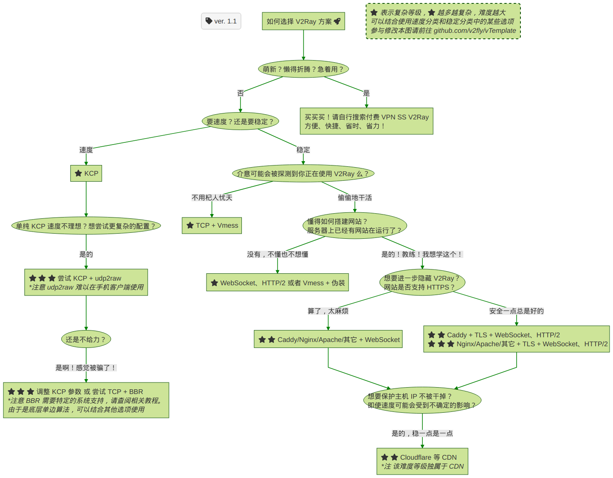

# vTemplate

这是一个社会实验性质的项目，提供标准的 V2Ray 配置模板。

## 贡献指南

欢迎你将自己使用的配置制作模板，提交 PR。

模板应遵守以下标准：
- 缩进使用 4 个空格
- 方 (花) 括号不换行
- 不需要的字段应该移除
- `log` 部分只留 `loglevel`
- 对于 `outbounds`，客户端应有 `proxy` 和 `direct`，服务端应有 `direct` 和 `block`
- 除非特定场景的模板，否则只处理 `geoip:private` 到 `direct` (服务端处理到 `block`)
- 除非特定场景的模板，配置文件中应不写 DNS
- `uuid` 应留空，由用户自行填写。
- `routing` 中的 `domainStrategy` 保持默认，即 `AsIs`。

### 举例

```yaml
{
    "log": {
        "loglevel": "warning"
    },
    "routing": {},
    "inbounds": [],
    "outbounds": []
}
```

### 客户端

```yaml
{
    "log": {
        "loglevel": "warning"
    },
    "routing": {
        "domainStrategy": "AsIs",
        "rules": [
            {
                "ip": [
                    "geoip:private"
                ],
                "outboundTag": "direct",
                "port": null,
                "type": "field"
            }
        ]
    },
    "inbounds": [
        {
            "port": 1080,
            "protocol": "socks",
            "settings": {
                "auth": "noauth",
                "udp": true
            },
            "tag": "socks"
        }
    ],
    "outbounds": [
        {
            "protocol": "vmess",
            "settings": {
                "vnext": [
                    {
                        "users": [
                            {
                                "alterId": 100,
                                "security": "aes-128-gcm",
                                "id": "",
                                "testsEnabled": "VMessAEAD"
                            }
                        ],
                        "port": 1234,
                        "address": "Your_IP_Address"
                    }
                ]
            },
            "streamSettings": {
                "network": "tcp"
            },
            "tag": "proxy"
        },
        {
            "protocol": "freedom",
            "settings": {
            },
            "tag": "direct"
        }
    ]
}
```

### 服务端

```yaml
{
    "log": {
        "loglevel": "warning"
    },
    "routing": {
        "domainStrategy": "AsIs",
        "rules": [
            {
                "ip": [
                    "geoip:private"
                ],
                "outboundTag": "blocked",
                "port": null,
                "type": "field"
            }
        ]
    },
    "inbounds": [
        {
            "port": 1234,
            "protocol": "vmess",
            "settings": {
                "clients": [
                    {
                        "id": "",
                        "alterId": 100,
                        "testsEnabled": "VMessAEAD"
                    }
                ]
            },
            "tag": "tcp",
            "streamSettings": {
                "network": "tcp"
            }
        }
    ],
    "outbounds": [
        {
            "protocol": "freedom",
            "settings": {
            },
            "tag": "direct"
        },
        {
            "protocol": "blackhole",
            "settings": {
            },
            "tag": "blocked"
        }
    ]
}
```

## 如何选取适合自己的配置：



附加说明：<br>
尽管 Websocket+TLS+Web 可能称得上是现阶段最好的方案，但**绝对**不是推荐新手一上来就尝试的方案，更不是 V2Ray 唯一的用法。<br>
同时，你应当了解，每个地区的网络状况不同 (主要指对不同协议的 QoS 程度)，你可以将所有配置都尝试一遍来寻找最适合自己的，尽量少问、最好不问“为什么我的 V2Ray 这么慢？”这样的问题。

## 最后

祝你玩的愉快，感谢原始作者 KiriKira 和 Project V 的所有开发人员，以及 v2ray.fun 的作者。
